

  <h1> ♢ zkSync Era - Smart Contracts Analysis ♢</h1>

  

## Index
- [Index](#index)
- [The Process and Steps We Followed for Codebase Evaluation](#the-process-and-steps-we-followed-for-codebase-evaluation)
- [1- zkSync Era Project Description Overview](#1--zksync-era-project-description-overview)
- [2- zkSync Era Mechanism Review](#2--zksync-era-mechanism-review)
  - [L1 contracts Infrastructure](#l1-contracts-infrastructure)
    - [zkSync](#zksync)
    - [Bridges](#bridges)
    - [Governance](#governance)
    - [Upgrades](#upgrades)
    - [Others](#others)
  - [L2 contracts Infrastructure](#l2-contracts-infrastructure)
    - [System Contracts](#system-contracts)
- [3- Documentation](#3--documentation)
- [4- Access Control Functions in the contracts](#4--access-control-functions-in-the-contracts)
    - [In L1 contracts](#in-l1-contracts)
    - [In L2 Contracts](#in-l2-contracts)
- [5- Architecture](#5--architecture)
  - [Demystification of the EraVM and Bootloader, how the compiler works, what unique features it provides](#demystification-of-the-eravm-and-bootloader-how-the-compiler-works-what-unique-features-it-provides)
    - [EraVM](#eravm)
    - [Bootloader](#bootloader)
    - [The flow is similar to the following diagram](#the-flow-is-similar-to-the-following-diagram)
    - [How the compiler works](#how-the-compiler-works)
    - [Unique features](#unique-features)
  - [The main differences about Bootloader and EraVM](#the-main-differences-about-bootloader-and-eravm)
  - [Why we focus on these components](#why-we-focus-on-these-components)
  - [The main changes that the users and protocols will be seen in the ecosystem after this release has been audited are as follows](#the-main-changes-that-the-users-and-protocols-will-be-seen-in-the-ecosystem-after-this-release-has-been-audited-are-as-follows)
- [6- Systemic \& Centralization Risks](#6--systemic--centralization-risks)
  - [Possible Mitigations](#possible-mitigations)
- [7- Codebase Quality Analysis](#7--codebase-quality-analysis)
- [8- Test Analysis](#8--test-analysis)
- [9- Recommendations](#9--recommendations)
    - [Monitoring Recommendations](#monitoring-recommendations)
- [10- Resources used to gain deeper context on the codebase](#10--resources-used-to-gain-deeper-context-on-the-codebase)
    - [Resources in spanish](#resources-in-spanish)
- [11- Conclusion](#11--conclusion)

## The Process and Steps We Followed for Codebase Evaluation
Our ``approach`` to analyzing the source code of the ``zkSync Protocol`` was to simplify the information provided by the protocol, using a variety of ``diagrams`` to visually clarify the project's key contracts and break down each important part of these contracts. This enhances understanding for ``developers``, ``security researchers``, and ``users`` alike. 

We identified the fundamental concepts and employed simpler language to explain the functionality and goals of the ``zkSync Protocol``.

Furthermore, we organized the information logically into separate sections, each with identifying titles, to provide a clear overall picture of the subject, our primary goal was to make the information more ``accessible`` and ``easy`` to understand.

## 1- zkSync Era Project Description Overview
``zkSync Era`` is a project ``aimed`` at enhancing ``Ethereum's scalability`` and ``privacy`` through ``Layer 2 (L2) solutions``, specifically ``zkEVM``. The project has three main sections: 
- Smart Contracts
- Virtual Machine
- Circuits.
  

## 2- zkSync Era Mechanism Review
- **Scope**
 The ``zkSync Era protocol`` provided a [Scope](https://github.com/code-423n4/2023-10-zksync#scope) that includes [L1 contracts](https://github.com/code-423n4/2023-10-zksync#l1-contracts), [L2 contracts](https://github.com/code-423n4/2023-10-zksync#l2-contracts), [Out of scope](https://github.com/code-423n4/2023-10-zksync#out-of-scope). 
 Let's take a look at the essential functions of these contracts that we considered more difficult and importants.

### L1 contracts Infrastructure
#### zkSync
  - **Executor.sol**: 
        The ``ExecutorFacet`` contract is responsible for ``processing`` and ``confirming`` batches of transactions, completing priority operations, and performing other necessary tasks for the protocol's operation.

    

  - **Mailbox.sol**: 
        This contract primarily handles the interaction between ``L1`` and ``L2`` in ``zkSync``, including proof verification, request handling, and withdrawal processing. It ensures that ``transactions`` and ``proofs`` are processed correctly and securely on the ``Layer 2 network``. Below is a detailed explanation of its components and functions:

    
  
  - **Diamond.sol library**:
    This is the helper library for managing the `EIP-2535` diamond proxy.

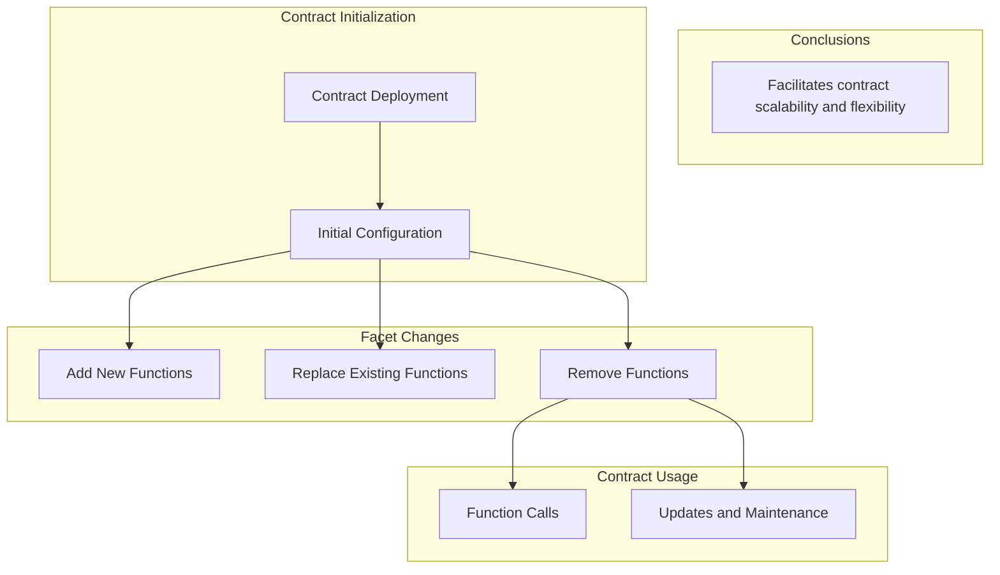
- **TransactionValidator.sol library**:
This library is for validating L1 -> L2 transactions.

```mermaid
    graph TD
    subgraph The main idea 
    -[These functions helps to validate L1 -> L2 transactions]
    end
    subgraph L1ToL2TransactionValidation
    A[IMailbox.L2CanonicalTransaction] -->|Validate| B[Transaction Properties]
    B -->|Validate| C[Minimal Costs]
    end

    subgraph UpgradeTransactionValidation
    D[IMailbox.L2CanonicalTransaction] -->|Check| E[Fields]
    E -->|Check| F[Other Fields]
    end

    subgraph MinimalPriorityTransactionGasLimit
    G[Get Encoding Length] -->|Calculate| H[Costs]
    H -->|Calculate| I[Total Gas Limit]
    end

    subgraph TransactionBodyGasLimit
    J[Get Total Gas Limit] -->|Calculate| K[Overhead]
    K -->|Check| L[Transaction Body Gas Limit]
    end
```

- **ValidatorTimelock.sol**:
  Intermediate smart contract between the validator EOA account and the zkSync smart contract, the primary purpose of this contract is to provide a trustless means of delaying batch execution without modifying the main zkSync contract. As such, even if this contract is compromised, it will not impact the main contract.

- **Admin.sol**:
  Admin Contract controls access rights for contract management.

- **DiamondInit.sol**:
  The contract is used only once to initialize the diamond proxy.

- **PriorityQueue.sol library**:
The library provides the API to interact with the `priority queue container`.

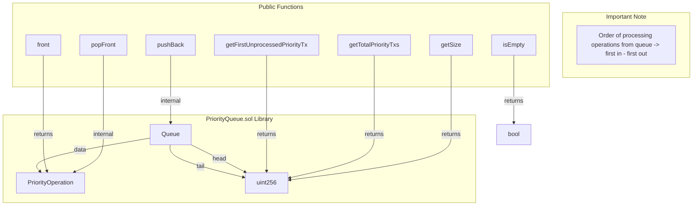

- **Merkle.sol library**:
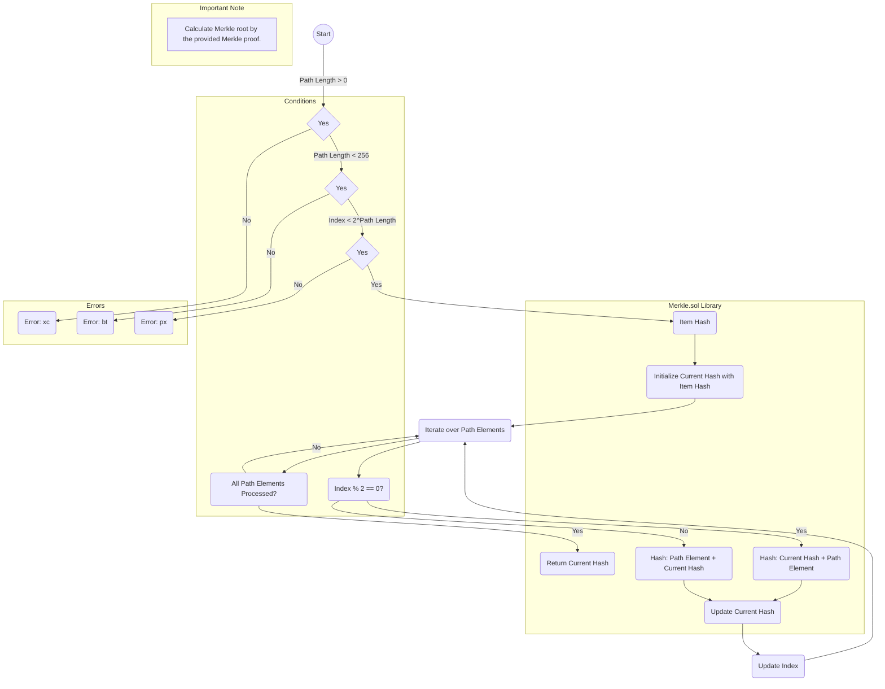

- **LibMap.sol library**:
Library for storage of packed unsigned integers.

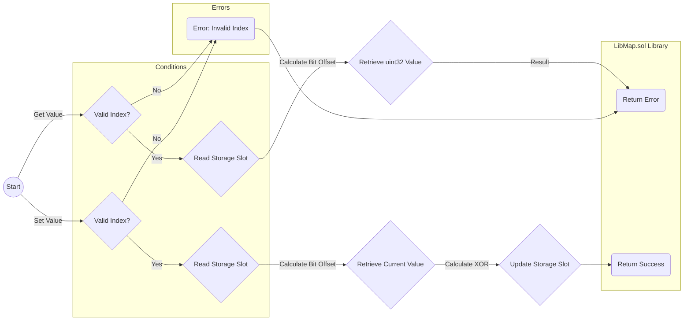
  - **DiamondProxy.sol**: 
        ``Diamond contracts`` are a design technique that allows for ``modular`` and ``seamless`` updates and extensions of ``smart contracts``.
        This contract is a ``proxy`` used to redirect function calls to an underlying `Diamond contract`. This allows for the ``efficient updating and extension`` of the ``Diamond contract's functionality`` without changing the proxy's address. The chainId verification ensures that the proxy contract is deployed on the correct chain to work with the corresponding Diamond contract.
        
    

  - **Base.sol**:
      Base contract containing functions accessible to the other facets.

#### Bridges 
  - **L1ERC20Bridge.sol**: 
        This contract acts as an ``intermediary`` that allows ``users`` to deposit ``ERC-20 tokens`` on ``Ethereum Layer 1 (L1)`` and then use them on ``zkSync layer 2 (L2)`` and vice versa. It also handles failure scenarios and provides mechanisms to ensure the security and integrity of ``deposit`` and ``withdrawal`` operations. The contract is a standard implementation of a token bridge and can serve as a reference for other custom bridges.
        
    

  - **L1WethBridge.sol**: 
        The ``contract`` is responsible for receiving ``WETH`` tokens on ``L1``, unwrapping them to ``ETH``, sending them to ``L2``, and then rewrapping them into ``WETH`` on ``L2`` for delivery to the ``L2`` recipient. It also handles ``withdrawals`` from ``L2`` to ``L1``, where ``ETH`` is ``wrapped`` into ``WETH`` and sent to the ``L1`` recipient. In summary, this contract makes the transfer of ``WETH`` tokens between ``L1`` and ``L2`` more efficient and straightforward for ``users``.
        
    

  - **BridgeInitializationHelper.sol library**:
This is a helper library for initializing L2 bridges in zkSync L2 network.

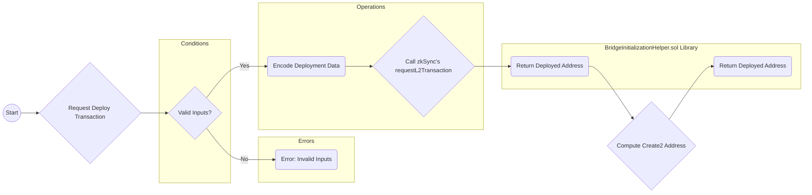
#### Governance 
  - **Governance.sol**: 
        This ``contract`` facilitates the ``management`` of ``governance`` operations with appropriate ``delays`` and ``permissions``. It can be used to schedule upgrades and changes in ``zkSync`` contracts and allows the ``security council`` to participate in the execution of these operations. Furthermore, it provides flexibility for scheduling transparent or "``shadow``" upgrades.
        
    

#### Upgrades 
  - **BaseZkSyncUpgrade.sol**: 
        This ``contract`` serves as a framework for concrete implementations of ``zkSync protocol upgrades``. It provides functions and structures that enable controlled changes in the system, ensuring that ``upgrades`` are executed at the right time and notifying users of important changes in the ``zkSync protocol``.
    

  - **DefaultUpgrade.sol**: 
        This ``contract`` defines a ``default upgrade strategy`` for ``zkSync protocol upgrades``, which can be customized for each upgrade. It ensures that protocol versions are updated, relevant components are upgraded, and proper events are emitted to notify users of the changes. ``Developers`` can create concrete ``zkSync protocol upgrades`` by extending and customizing this contract to fit their specific requirements.
    

#### Others
  - **AllowList.sol**:
        The smart contract that stores the permissions to call the function on different contracts.

  - **L2ContractHelper.sol library**:
Helper library for working with L2 contracts on L1.

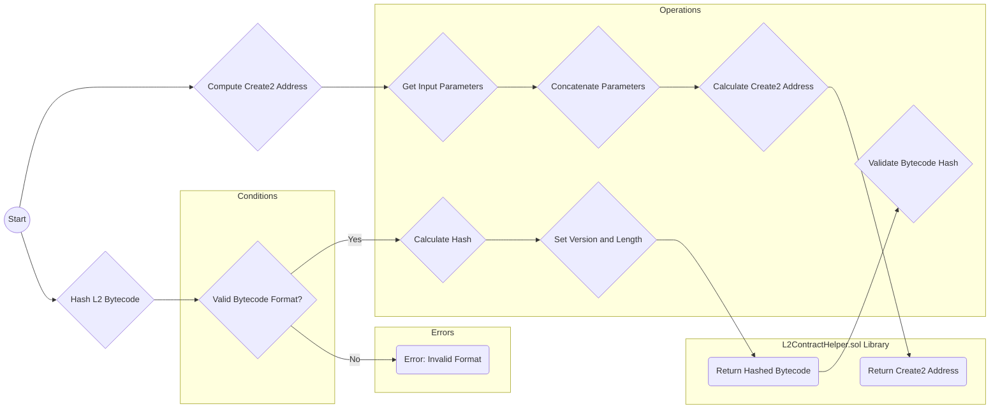

- **ReentrancyGuard.sol**: Contract module that helps prevent reentrant calls to a function.

- **UnsafeBytes.sol library**:
The library provides a set of functions that help read data from an "abi.encodePacked" byte array.
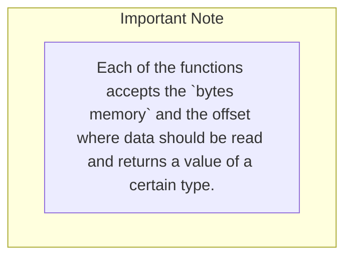
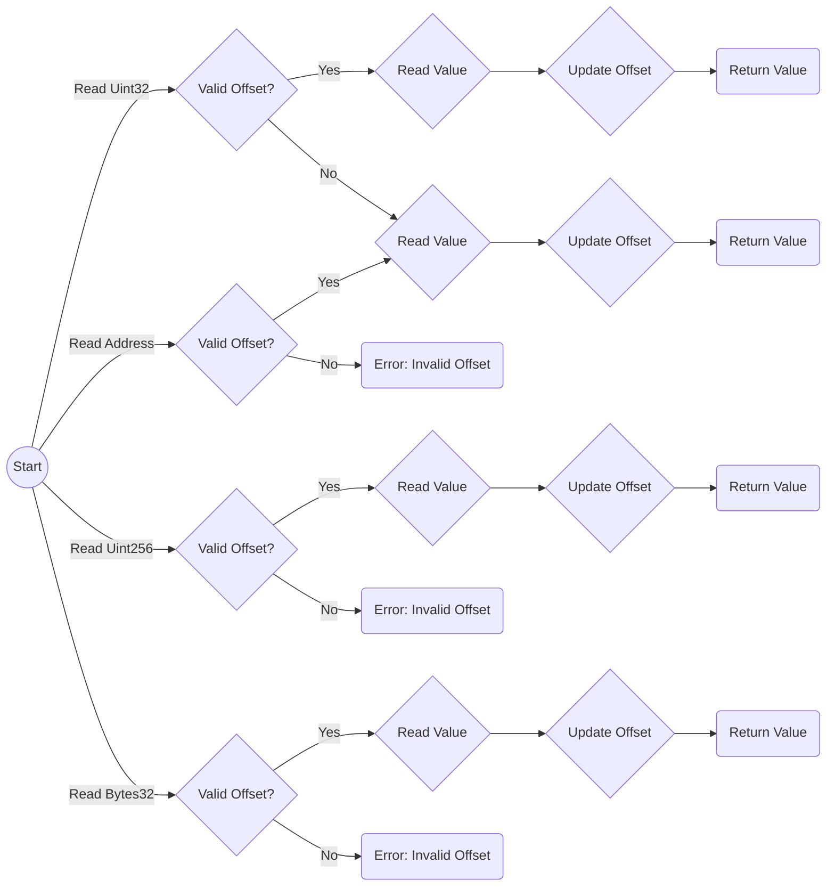

- **UncheckedMath.sol library**:
The library for unchecked math.

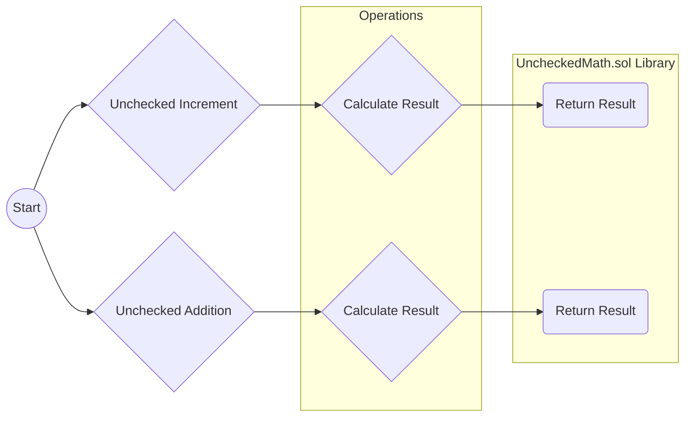

- **L2ContractAddresses.sol**:
  The address of the L2 deployer system contract.

### L2 contracts Infrastructure
#### System Contracts
  - **TransactionHelper.sol library**:
This library is used to help custom accounts to work with common methods for the Transaction type.
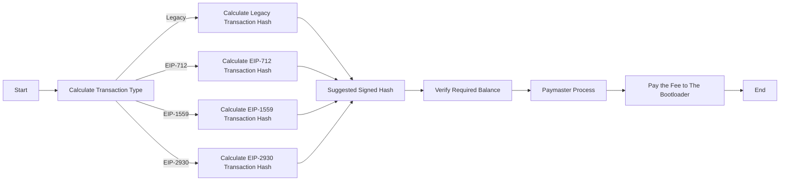

- **BootloaderUtilities.sol**:
  A contract that provides some utility methods for the bootloader that is very hard to write in Yul.
  

- **SystemContext.sol**:
  Contract that stores some of the context variables, that may be either block-scoped, tx-scoped or system-wide.
  

- **L1Messenger.sol**:
  Smart contract for sending arbitrary length messages to L1.
  

- **ContractDeployer.sol**:
  System smart contract that is responsible for deploying other smart contracts on zkSync.
  
  
- **SystemContractHelper.sol library**:
Library used for accessing zkEVM-specific opcodes, needed for the development of system contracts.

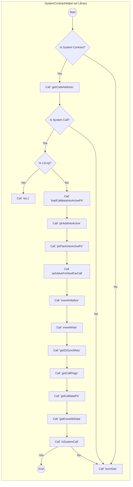

- **EfficientCall.sol library**:
This library is used to perform ultra-efficient calls using zkEVM-specific features.

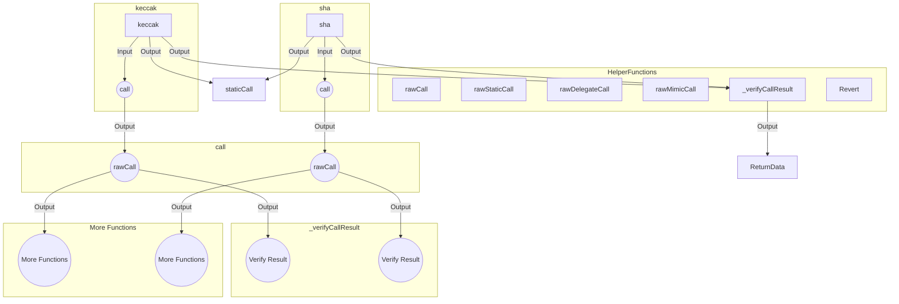

- **SystemContractsCaller.sol library**:
A library that allows calling contracts with the `isSystem` flag.

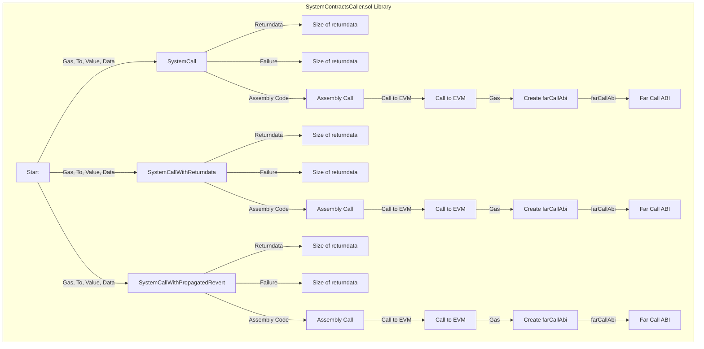

- **Compressor.sol**: Contract with code pertaining to compression for zkEVM; at the moment this is used for bytecode compression and state diff compression validation.

- **DefaultAccount.sol**: The default implementation of account.

- **NonceHolder.sol**: A contract used for managing nonces for accounts. Together with bootloader, this contract ensures that the pair (sender, nonce) is always unique, ensuring unique transaction hashes.
  
- **RLPEncoder.sol library**:
This library provides RLP encoding functionality.

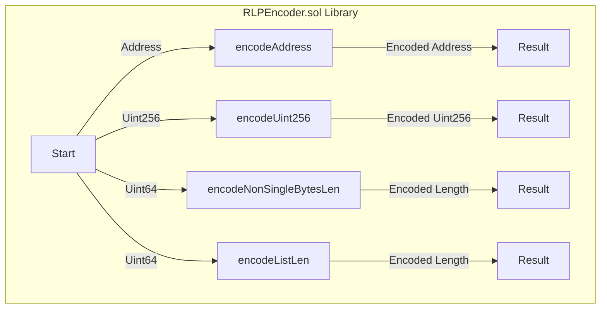

- **L2EthToken.sol**: Native ETH contract.

- **AccountCodeStorage.sol**: The storage of this contract serves as a mapping for the code hashes of the 32-byte account addresses. 

- **Utils.sol library**:
Common utilities used in zkSync system contracts.

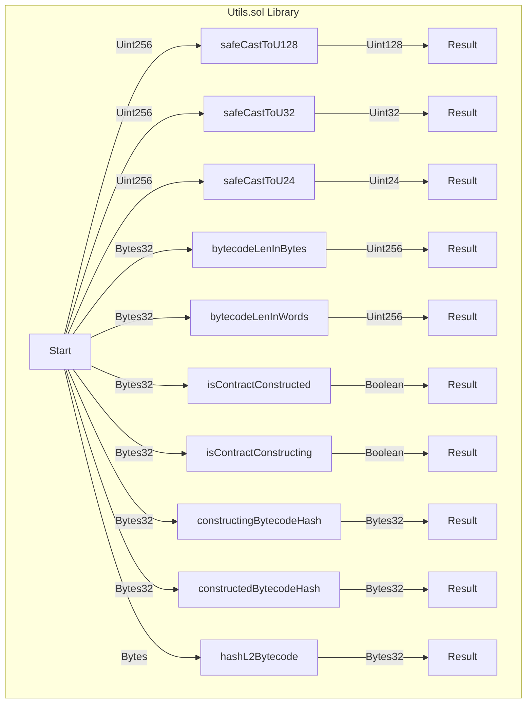

- **KnownCodesStorage.sol**: The storage of this contract will basically serve as a mapping for the known code hashes.

- **MsgValueSimulator.sol**: The contract responsible for simulating transactions with `msg.value` inside zkEVM.

- **UnsafeBytesCalldata.sol library**:
The library provides a set of functions that help read data from calldata bytes.

- **ImmutableSimulator.sol**: System smart contract that simulates the behavior of immutable variables in Solidity.

- **ComplexUpgrader.sol**: Upgrader which should be used to perform complex multistep upgrades on L2. In case some custom logic for an upgrade is needed this logic should be deployed into the user space and then this contract will delegatecall to the deployed contract.

## 3- Documentation
Carrying out this code review has been an ``extremely user-friendly experience``, as it has allowed us to comprehensively understand each aspect of the system's operation. The documentation of the ``zkSync`` project is exceptionally thorough and comprehensive, providing a strong overall view of the project's structure and how its various components function. To further enhance this detailed documentation, we have chosen to ``create comprehensive diagrams`` that visually represent each contract provided by zkSync team. 
With considerable enthusiasm, we have dedicated several days to crafting these diagrams with the aim of providing an even clearer and more accessible understanding of the underlying project architecture. We are confident that these diagrams will bring significant value to the protocol as they can be seamlessly integrated into the existing documentation, enriching it and providing a more comprehensive and detailed understanding for users, developers and auditors.

## 4- Access Control Functions in the contracts
#### In L1 contracts 
1. `onlyValidator` in the [Executor.sol](https://github.com/code-423n4/2023-10-zksync/blob/main/code/contracts/ethereum/contracts/zksync/facets/Executor.sol) contract this `onlyValidator` can execute the following functions:
    - **commitBatches**
    - **executeBatches**
    - **proveBatches**
    - **revertBatches**
the ``onlyValidator`` is manage by **Matter Labs multisig**.

**Note: the sponsor let us know that -> Please also note, that for the validator we also use ValidatorTimelock contract, so our server interacts with ValidatorTimelock and ValidatorTimelock interacts with DiamondProxy. This way, we have a delay between commit and execute of the batch. So even if someone will get access to validator private key, it will need to wait 21 hours (current delay) to execute the batch. And governor can revert the batch if notice such behaviour. We implemented this security feature to prevent any possibilities of bugs that can be exploited only with validator access.  In the future, it can change and we would have set of validators.**   

1. `onlyOwner` is use on the [ValidatorTimelock.sol](https://github.com/code-423n4/2023-10-zksync/blob/main/code/contracts/ethereum/contracts/zksync/ValidatorTimelock.sol) contract to set:
    - **setValidator**
    - **setExecutionDelay**
  
the `onlyOwner` is manage by **Matter Labs multisig**.

3. In [AdminFacet.sol](https://github.com/code-423n4/2023-10-zksync/blob/main/code/contracts/ethereum/contracts/zksync/facets/Admin.sol) is use `onlyGovernorOrAdmin`, `onlyGovernor` and The admin facet is controlled by two entities:

- **Governance** -> Separate smart contract that can perform critical changes to the system as protocol upgrades. This contract controlled by `two multisigs`, one manage by **Matter Labs team** and **another will be multisig with well-respected contributors in the crypto space**. Only together they can perform an instant upgrade, the Matter Labs team can only schedule an upgrade with delay.

- **Admin** -> Multisig smart contract **managed by Matter Labs** that can perform non-critical changes to the system such as granting validator permissions. **Note, that the Admin is the same multisig as the owner of the governance**.

4. In [Governance.sol](https://github.com/code-423n4/2023-10-zksync/blob/main/code/contracts/ethereum/contracts/governance/Governance.sol) contract exits three different access control functions that can manage certain functions:
    - `onlySelf` -> this is managed by the **Governance.sol** contract. This function has the permission to  **updateDelay** and **updateSecurityCouncil**.
    - `onlySecurityCouncil` -> this is managed by an `active` security council address. This function has the permission to **executes the scheduled operation with the security council instantly**.
    - `onlyOwnerOrSecurityCouncil` -> this is managed by an `active` owner or an `active` security council. This funtion has the permission to `call` and `execute` the scheduled operation (but the execute functions only after the delay passed).

5. In the contract [AllowList.sol](https://github.com/code-423n4/2023-10-zksync/blob/main/code/contracts/ethereum/contracts/common/AllowList.sol) the `onlyOnwer` is managed by the [Governance contract](https://github.com/code-423n4/2023-10-zksync/blob/main/code/contracts/ethereum/contracts/governance/Governance.so) and this function has permission to: 
   - **setAccessMode** -> Set the permission mode to call the target contract.
   - **setBatchAccessMode** -> Set many permission modes to call the target contracts.
   - **setBatchPermissionToCall** -> Set many permissions to call the function on the contract to the specified caller address.
   - **setPermissionToCall** -> Set the permission to call the function on the contract to the specified caller address.
   - **setDepositLimit** -> Set deposit limit data for a token.

#### In L2 Contracts
1. We see frequently the following `onlyCallFromBootloader` access control funtion in the System Contracts and this function is managed by the `bootloader.yul` contract and th formal address of bootloader is **0x8001** implementation stored in the bootloader.yul.

**Note:** If you want to see and track specific address to getting contract state from outside the batch chain you can use the [Getters.sol](https://github.com/code-423n4/2023-10-zksync/blob/main/code/contracts/ethereum/contracts/zksync/facets/Getters.sol) contract.

- ``onlyValidator``: This is L1 check, and onlyBootloader is L2 check. Just in case.

## 5- Architecture 
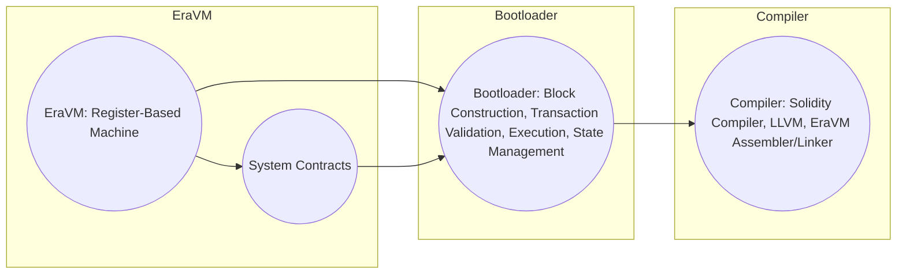

### Demystification of the EraVM and Bootloader, how the compiler works, what unique features it provides 
#### EraVM 
**Note: We want users, auditors and devs to learn what EraVM is and what its differentiating factors are through a comparison with EVM (as many understand its structure).**

EraVM is a **virtual machine** designed for `smart contract execution`, particularly in the context of the zkSync blockchain. It has several key differences compared to the Ethereum Virtual Machine (EVM), which is commonly used for executing smart contracts on the Ethereum blockchain. Let's break down the important aspects of EraVM and how it differs from EVM:

**Register-Based Machine vs. Stack-Based Machine:**

| Aspect                                      | EraVM                                                    | EVM                                                      |
|---------------------------------------------|----------------------------------------------------------|----------------------------------------------------------|
| **Register-Based Machine vs. Stack-Based Machine** | - EraVM is a register-based virtual machine. It primarily uses 16 registers (r0, r1, ..., r15) for executing instructions. This register-based approach is similar to modern computer architectures and simplifies the implementation of zero-knowledge proofs.                 -There is available stack for saving data and sometimes opcodes can operate on it | The Ethereum Virtual Machine (EVM) is stack-based, meaning it operates on a stack data structure, with instructions pushing and popping values onto/from the stack. |
| **Native Word Size**                            | The native data type in EraVM is a 256-bit wide unsigned integer, referred to as a "word." | EVM also uses 256-bit words for most operations.           |
| **Transient State**                              | EraVM provides several components for executing contracts: Registers (r0 to r15): General-purpose registers for computations. Flags (LT, EQ, GT): Boolean flags used to track comparison results. Data Stack: Holds words and is free to use. Heap: Used for passing data between functions and contracts, but it is bounded. Code Memory: Stores contract code and can be used as a constant pool. | EVM primarily deals with integers, and there's no concept of pointers to other contracts' data. |
| **Instruction Format**                           |-  EraVM instructions typically operate on registers and follow a specific format, including modifiers for setting flags, predicates for conditional execution, and swap for operand exchange. - EraVm instruction is 8 bytes long.  | - EVM instructions operate on the stack, with opcodes for various operations.  - EVM 1 byte long + immediate|
| **Calls and Returns**                            | EraVM supports jumps and external calls too. But in addition it has near calls, that is a way how to call function inside the same context with the same memory, etc, with provided gas limit. When one do jump, there is no way to: 1. Set gas limit. 2. Handle an exception. With **near call** it is possible. | EVM also supports both supports jumps and external calls |
| **Fat Pointers**                                 | EraVM introduces the concept of "fat pointers" which are used to pass read-only data between contracts and is cheap because doesn't require memory copying between contracts. **Fat pointers** include an offset within a data fragment. | EVM does not have a concept of fat pointers but to make an external call which takes calldata as an argument, one need to copy calldata into memory and then pass data. And on EraVM one can pass calldata directly.|
| **Static Mode**                                  | EraVM has a static mode that prevents contracts from modifying their storage and emitting events during execution. EraVM can make **staticcall** and even **delegatestaticcall**. | There is **staticcall** opcode in EVM, when contract called with this opcode any state changes would lead to revert. |
| **System Contracts**                             | EraVM includes a set of **system contracts** with privileged instructions. These contracts handle various functionalities within the blockchain. | EVM manage something like [precompiles](https://www.rareskills.io/post/solidity-precompiles). |
| **Server and VM Environment**                   | EraVM is controlled by a server and can execute transactions in a batch, with the bootloader responsible for forming new blocks. | EVM is used within the Ethereum network and relies on validators to include transactions in blocks. |
| **Bootloader**                                   | The bootloader it just entry point for **EraVM** execution responsible for block construction and executing transactions. | EVM doesn't have a concept of a bootloader, block construction is typically handled by validators. |

`EraVM` introduces several innovations compared to the traditional EVM, including a `register-based architecture, fat pointers, a static mode, and system contracts, to improve efficiency and flexibility in executing smart contracts on the zkSync blockchain`. These differences make EraVM a unique virtual machine tailored to the zkSync ecosystem.

#### Bootloader
The Bootloader in EraVM is an innovative system contract that plays a crucial role in the blockchain's operation. Here are some key points highlighting its innovation and importance:

- **Block Construction**: The Bootloader is responsible for block construction, a fundamental process in any blockchain. It facilitates the creation of new blocks by executing a set of transactions.

- **Interface Between Server and EraVM**: The Bootloader's heap acts as an interface between the server and the EraVM. It receives transaction data from the server, following a specific convention, and uses this data to form new blocks. Bootloader starts its ``execution`` with pre-set memory (memory already has something inside) and ``server`` set this initial memory to bootloader,

- **Transaction Validation**: The Bootloader validates transactions, ensuring they adhere to the blockchain's rules and policies. If a transaction is malformed, it fails, and the server can restart EraVM from the most recent snapshot, excluding the problematic transaction.

- **Transaction Execution**: It executes valid transactions to create a new block. This execution includes processes like charging fees, updating the block's parameters, and executing the transaction logic.

- **State Management**: After each transaction, the server takes a snapshot of the EraVM state. This snapshot mechanism ensures that even if a transaction fails or EraVM panics during processing, the blockchain's integrity is maintained.

- **Protocol Integration**: The exact code of the Bootloader is a part of the blockchain protocol, and its hash is included in the block header. This integration ensures the security and consistency of block construction.

#### The flow is similar to the following diagram

The Bootloader is innovative because it serves as the backbone of block creation in EraVM, dynamically loads its code, acts as an intermediary between the server and EraVM, and provides transaction validation and execution while maintaining the blockchain's integrity. Its design and role are critical for the efficient and secure operation of the zkSync blockchain. 

#### How the compiler works
Detailed description of how the compiler works in zkSync Era. Here is a summary of key concepts:

- **Solidity Compiler**: The original Solidity compiler (solc) is called as a subprocess by the zkSync compiler (zksolc) to obtain the intermediate representation (IR) of the project's source code.

- **LLVM**: The LLVM compiler framework is used for optimizations and assembly generation.

- **EraVM Assembler/Linker**: This tool written in Rust translates the assembly emitted by LLVM into the target EraVM bytecode.

- **Virtual Machine**: EraVM is the custom virtual machine used in zkSync, with a custom instruction set.

- **Intermediate Representation (IR)**: Various intermediate representations like Yul, EVMLA, and LLVM IR are used to represent the source code internally within the compiler.

- **Heap and Auxiliary Heap**: These are non-persistent memory segments used for data storage. The heap is globally accessible, while the auxiliary heap is used for zkSync-specific calls and returning data from the constructor.

- **Calldata and Return Data**: These are non-persistent memory segments used for input and output data of contract calls.

- **Contract Storage**: It is the persistent memory of the contract, similar to storage in Ethereum.

- **System Contracts**: zkSync has a special set of kernel contracts written in Solidity by Matter Labs.

- **Contract Context**: It is a special storage in the virtual machine that stores data like the current address and caller's address.

**The compiler translates source code in Solidity or Yul into EraVM bytecode and also handles memory and storage management. Additionally, it uses different intermediate representations to optimize the code before generating the final bytecode. System contracts and contract context are essential for zkSync's operation.**

The custom instruction set and zkSync-specific storage structure are critical for its efficient and secure operation.

The table provides a translation of instruction names between Yul, EVMLA, and EraVM bytecode, along with information about their functionality and usage.

For more details on how zkSync Era achieves equivalence with EVM, see the [Instructions](https://github.com/code-423n4/2023-10-zksync/tree/main/docs/VM%20Section/How%20compiler%20works/instructions) section.

#### Unique features
zkSync stands out due to its distinctive characteristics, including a tailored instruction set, dynamic code loading, a versatile compiler supporting multiple Intermediate Representations (IRs), efficient memory and storage management, optimization capabilities, system contracts, error handling based on snapshots, protocol integration, and custom assembly/linking tools. These combined attributes significantly enhance zkSync's innovative and efficient blockchain architecture.

### The main differences about Bootloader and EraVM
`EraVM` and `Bootloader` are two distinct components in the zkSync architecture, each with different roles and functions within the system.
- Here is a description of the key differences between EraVM and Bootloader
EraVM is a **virtual machine**, bootloader is a program that executes on EraVM.
The same as EVM is a virtual machine and Uniswap is a program that executes on it, the difference between usual "smart contracts" and "bootloader" is that bootloader is a **system program** that in zkSync plays a crucial role in optimizing the execution of transactions and improving efficiency by processing batches of transactions as a single program.

**The easiest way to think about bootloader is to think in terms of EntryPoint from EIP4337: it also accepts the array of transactions and facilitates the Account Abstraction protocol.**

### Why we focus on these components 
EraVM, Bootloader, and the compiler are so important for zkSync Era understanding: 

- EraVM -> is an execution environment and devs should know the difference between EVM and EraVM.
- Bootloader -> is a program that determine "consensus rules" - what transactions are valid, how much fees need to be taken, how to interact with account abstraction wallets, what is possible to do within the batch and what not.
- System contracts -> A set of important contracts that provide functionality for unique usecases (AA, cheap deployment and etc)
- Compiler -> What unique feature dev can use in their code, how to use and what is the difference between solc compiler.

### The main changes that the users and protocols will be seen in the ecosystem after this release has been audited are as follows
1. Cheaper transactions with the new proof system (Boojum). 
2. Cheaper transactions due to the [pubdata](https://github.com/code-423n4/2023-10-zksync/blob/main/docs/Smart%20contract%20Section/Handling%20pubdata%20in%20Boojum.md#handling-pubdata-in-boojum) compression. 
3. New precompiles.
4. Better trust assumptions due to new Governance mechanism.

## 6- Systemic & Centralization Risks

- In the Governance Multisig: It is mentioned that the "Governance" contract is controlled by two multisigs, one managed by the Matter Labs team and another by respected contributors in the crypto space. If these multisigs do not represent a wide diversity of actors or if their control is overly centralized, there is a risk that significant decisions in the network are influenced by a small group of entities.

- In the ValidatorTimelock.sol contract, the onlyOwner function is utilized to configure setValidator and setExecutionDelay.

- In the AdminFacet.sol contract, the onlyGovernorOrAdmin function is employed. This function grants control over certain functions to an entity that is the governor or admin of the system.

- In the AllowList.sol contract, the onlyOwner function is in use and provides the authority to perform actions related to setting access modes and permissions for specific contracts.

**If the only owner or some addresses are compromised, the attacker could use these functions to steal funds or disrupt the operation of the system.**

### Possible Mitigations
- Use role based owners By using role-based owners, you can reduce the risk of a compromised only owner impacting your protocol. If an attacker were to gain control of one of the roles, they would only be able to make changes related to that role.

## 7- Codebase Quality Analysis
The codebase is a well detailed one with the NATSPECS, and structural integrity in which the same patterns are used on the different contracts. As an example to above, the contract layout flow is more or less same in all contracts where applciable; errors --> events --> structs (a special constructor struct) --> state variables --> constructor --> functions (external, internal, privilaged) --> modifiers

This kind of engineering is not even making the reviewer lost in the code.

## 8- Test Analysis
The test coverage is 100%, and we love to know that. Additionally, the team informs us that they are currently working on invariant tests to verify that certain key properties remain constant and, in this way, enhance the security of the project. These tests are essential to ensure the consistency and correct behavior of the system as changes and updates are made, which is particularly important in critical projects like zkSync.

## 9- Recommendations
1. While the documentation for the codebase is excellent, the contract flow is not particularly clear as a user can enter the ecosystem in various ways. It is recommended that the docs are updated to describe important contracts and their functions.
2. There are many areas where the documentation is either incorrect or simply does not match the code. It is recommended to keep Natspecs up to date to avoid confusion.
3. If you are using a floating version of Solidity, such as ^0.8.0, this means that your codebase will be compatible with all versions of Solidity from ^0.8.0 to the latest version. This can be useful if you are not sure which version of Solidity you want to use, or if you need to support multiple versions of Solidity.
**Overall, I would recommend using the latest version like 0.8.19 of Solidity if possible.**

#### Monitoring Recommendations
1. While audits help in identifying code-level issues in the current implementation and potentially the code deployed in production, the zkSync team is encouraged to consider incorporating monitoring activities in the production environment. Ongoing monitoring of deployed contracts helps identify potential threats and issues affecting production environments. With the goal of providing a complete security assessment, the monitoring recommendations section raises several actions addressing trust assumptions and out-of-scope components that can benefit from on-chain monitoring.

2. We suggest including high-quality articles on ``Medium``, as it's an excellent way to provide an in-depth understanding of many project topics, and it's a common practice in many blockchain projects.

## 10- Resources used to gain deeper context on the codebase
- [About zkSync](https://docs.zksync.io/userdocs/intro/#introduction)
- [Problems zkSync solves](https://docs.zksync.io/userdocs/intro/#problems-zksync-solves)
- [Intro to zkSync's zk](https://github.com/code-423n4/2023-10-zksync/blob/main/docs/Circuits%20Section/Intro%20to%20zkSync%E2%80%99s%20ZK.md#intro-to-zksyncs-zk)
- [Zero Knowledge Proof](https://www.youtube.com/watch?v=-2qHqfqPeR8&t=1s) - **video**
- [Zero Knowledge Proof](https://medium.com/@lucafra92/a-guide-to-zero-knowledge-proofs-f2ff9e5959a8) - **Medium**
- [EraVM Formal specification](https://github.com/code-423n4/2023-10-zksync/blob/main/docs/VM%20Section/EraVM%20Formal%20specification.pdf)
- [How The compiler Works](https://github.com/code-423n4/2023-10-zksync/blob/main/docs/VM%20Section/How%20compiler%20works/overview.md)
- [About Boojum gadgets](https://github.com/code-423n4/2023-10-zksync/blob/main/docs/Circuits%20Section/Boojum%20gadgets.md)
- [About Bootloader](https://github.com/code-423n4/2023-10-zksync/blob/main/docs/VM%20Section/ZkSync%20Era%20Virtual%20Machine%20primer.md#bootloader)
- [About zkEVM](https://docs.zksync.io/zkevm/#general)
- [Differences with Ethereum](https://era.zksync.io/docs/reference/architecture/differences-with-ethereum.html#codesize)

#### Resources in spanish 
- [Zero Knowledge Proof](https://www.youtube.com/watch?v=D61HHyEl-Gw) - **vídeo**
- [Zero Knowledge Proof](https://academy.bit2me.com/zkp-zero-knowledge-protocol/) - **artículo**
- [Sobre zkSync](https://www.gate.io/es/learn/articles/what-is-zksync/279) - **artículo**

## 11- Conclusion
In general, the zkSync project exhibits an interesting and well-developed architecture we believe the team has done a good job regarding the code, but the identified risks need to be addressed, and measures should be implemented to protect the protocol from potential malicious use cases. It is also highly recommended that the team continues to invest in security measures such as mitigation reviews, audits, and bug bounty programs to maintain the security and reliability of the project.

### Time spent:
96 hours